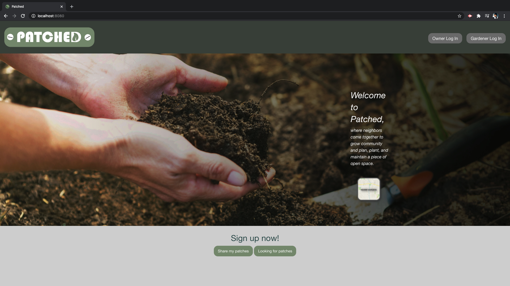

# PATCHED

Table of Contents

[Authors](#authors)

[Basic Overview of Project](#basic-overview-of-project)

[User Stories](#user-stories)

[Homepage Screenshot](#homepage-screenshot)

[Resources Used](#resources-used)

[Further Development Plans](#further-development-plans)

Deployed site: https://patchedapp.herokuapp.com/

# Authors

- Shunpin Tseng
> Github: https://github.com/Shunpintseng

- Elijah Blaisdell
> Github: https://github.com/elijah415hz

- Petar Zivkovic
> Github: https://github.com/Petar85

- Jae Kim
> Github: https://github.com/JSK321

- Christopher Wesonga
> Github: https://github.com/ckomodo

# Basic Overview of Project

P-Patch is the name given to the City of Seattle's community gardens. The name commemorates the Picardo family who operated a truck farm- in the Wedgwood area in the early twentieth century. 
Community gardens are spaces where neighbors come together to grow community and plan, plant, and maintain a piece of open space. Members practice organic gardening techniques and plant a mix of food crops, flowers, herbs, fruiting bushes & trees.
Traditionally community gardens include individual plots for which community members pay a small fee, while common areas in the garden are maintained by all plot holders. In addition of paying the annual fee, P-Patch gardeners must donate a designated number of volunteer hours to the P-Patch, and many give much more of themselves than the minimum requirement.
With sharply escalating population growth and the development boom, Seattle has been experiencing a high demand for P-Patch plots. The city website noted that wait times can be up to four years, depending on location.
Our contribution to the P-Patch Program is to help address the demand challenges. By streamlining communication we aim to make it easier and more efficient for enthusiastic gardeners to connect.

# User Stories
- AS A person who has a P-Patch or garden space
- I WANT want to rent it out to gardeners
- SO THAT the space can be used for gardening
- AS A person looking for a garden/p-patch
- I WANT to see available P-patches/gardens in my area
- SO THAT I can contact the owner and use the space for gardening
- AS A person who is looking to dispose of/sell compost
- I WANT to search my area for people looking for compost
- SO THAT I can sell/give it to them
- AS A person who is looking for compost
- I WANT to search for people selling/giving compost around me
- SO THAT I can use the compost in my garden

# Homepage Screenshot

# Resources Used

Joe Rehfuss for project idea, and specific assistance on syntax as needed.

Aslan Ghodsian help with user authentication.

History Link for the history of P-Patch program in Seattle. The full article can be found here:
https://www.historylink.org/File/20662

# Further Development Plans

1. Credit Card Payment can be added so owners and gardeners can transact on the app
2. Direct messaging in the app for users with an account
4. Algorithm for proximity search when searching for garden/p-patch or compost
3. Add a database of crops/flowers/plants that do well in a selected area
4. Seed-sharing
5. Garden tool sharing
6. Users to upload photos of gardens and/or composts on the app

Implementing these functionalities required more time and resources than we had.